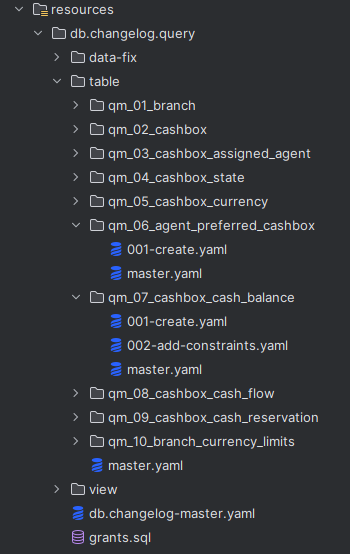

# SLSP FENX

⬢ O Fenixe - keď jeden hexagon nestačí ⬢

## Kontext projektu

### Predmet projektu

Prepis pobočkového sýstemu banky (FE) do nových technológií a architektury

* Povodná technológia: Finantix framework
* Nové technológie: Java / Kotlin, Spring Boot, Camunda, WebFlux, ...
* Povodná architektúra: Monolitický systém
* Cieľová architektúra: Mikroservisná architektúra s podporou BPMN engine

### Rozsah projektu

* cca 100 biznis procesov (rôzneho rozsahu)
* necelých 5 rokov práce
* 40 ľudí / 30 FTE / xk MD (Softec tím)

### Výstup projektu

Dodali sme

* 🖥️ 1 FE appka (React SPA)
* ⚙️ 6 Procesných aplikácií (Camunda BPMN) v Kotline
* ☕ 10-15 Mikroslužieb v Kotline&#x20;

## Technológie

### Procesné aplikácie

* Hexagonálna architektúra (1-2x 😁)
* Spring - Spring Boot, Spring MVC, Spring Cloud
* Kotlin / Java
* Camunda BPMN
* JPA / Hibernate
* Flyway
* Oracle DB
* Maven
* GitLab CI / Jenkins

<figure><figcaption><p>Štruktúra OWFE Crossfunctional appky</p></figcaption></figure>

### Mikroslužby

* Hexagonálna architektúra
* Spring - Spring Boot, Spring WebFlux, Spring Cloud
* Kotlin / Java
* JPA / Hibernate
* Liquibase
* Oracle DB / Mongo
* Gradle
* GitLab CI / Jenkins

<figure><figcaption><p>Štruktúra CLE appky</p></figcaption></figure>

## Čo sa osvedčilo a čo nie

### Maven vs Gradle

* Maven
  * funguje 👍
* Gradle
  * kompaktný zápis závislostí 👍
  * SLSP custom DSL 👎

### Testy

* JUnit testy (mockk, kotest)
* Procesné testy

```kotlin
@Test
fun `and is sent for processing and type changed then process ends`() {
    val workflowRequestType = repository.saveAndFlush(
            workflowRequestTypeEntity(
                id = UUID.randomUUID().toString(),
                actionType = WorkflowActionType.PROCESSING_ONLY))

    // run
    startProcessForClient(CLIENT_ID)

    refreshProcessVariables()
    refreshDataAndAssertCurrentTask(UT_INPUT_REQUEST_DATA)
    completeCurrentTask(continueInputRequestDataVariables(workflowRequestType))

    refreshProcessVariables()
    refreshDataAndAssertCurrentTask(UT_PROCESS_REQUEST)
    completeCurrentTask(processRequestChangeTypeVariables(workflowRequestType.id.toString()))

    refreshProcessVariables()
    refreshDataAndAssertCurrentTask(UT_PROCESS_REQUEST)
    completeCurrentTask(processRequestConfirmVariables())

    // verify
    assertProcessEnded()
    identityService.clearAuthentication()

    assertPassedTroughActivities(
        ST_GENERATE_AND_SAVE_REQUEST_DRAFT,
        UT_INPUT_REQUEST_DATA,
        UT_PROCESS_REQUEST,
        EG_COMPLETE_ACTION_AFTER_INPUT
    )
    assertNotPassedTroughActivities(EE_REQUEST_CANCELLED)
}
```

### Kotlin

Oproti klasickej Jave umožnil písať

* stručnejší a čitateľnejší kód&#x20;
* kód výrazne oddolnejší voči NPE
* kód lepšie vyjadrujúci zámer programátora

Features

* **Null safety**‼️&#x20;
  * non-nullable (_default_) vs nullable (`?`)
  * lepšie ako `@NonNull` / `@Nullable`  (v rôznch verziách)
* `val` vs `var`  - programátor musí explicitne zadefinovať mutability&#x20;
* `data class` - lepšie ako Java record-y alebo `@Data` / `@Value` z Lomboku
* pomenované (`named`) argumenty
  * čiastočne nahradené v Jave `@Builder` z Lomboku (len pre konštruktory)
* String templates
* default argumenty
* expression ako telo funkcie
* automatické pretypovanie
* `when` - flexibilnejší ako `switch`&#x20;
* extension funkcie

Príklad




```kotlin
// scope functions
fun normalize(string: String) = string
  .mapIndexed { index, c -> 
      if (index % 2 == 0) c.uppercaseChar() else c.lowercaseChar() 
  }
  .joinToString("")

val normalizedResult = someNullableResult()?.let { normalize(it) }
println("normalized result is $normalizedResult")

// extension function
fun String.normalizeExt() = normalize(this)

val normalizedResult = someNullableResult()?.normalizeExt()
println("normalized result is $normalizedResult")
```




```java
static String normalize(String string) {
  var result = new StringBuilder();

  for (int i = 0; i < string.length(); i++) {
    char c = string.charAt(i);
    result.append(i % 2 == 0 ? toUpperCase(c) : toLowerCase(c));
  }

  return result.toString();
}

// plain java
var nullableResult = someNullableResult();
var normalizedResult = nullableResult != null ? normalize(nullableResult) : null;
System.out.printf("Normalized result: %s\n", normalizedResult);

// utility method - https://gitlab.softec.sk/ec-dodavka/java/shared-libs
var normalizedResult = mapNotNull(someNullableResult(), it -> normalize(it));
System.out.printf("Normalized result: %s\n", normalizedResult);
```



Príklad




```kotlin
data class User(
  val id: Int,
  val name: String,
  var alias: String? = null, // nullable, default value
  var active: Boolean = true, // default value
  val skills: MutableList<Skill> = mutableListOf(),
) {

  data class Skill(val name: String, var level: Int) {
    init { require(level in 1..10) { "level must be between 1 and 10" } }

    fun incrementLevel(increment: Int = 1): Int {
      require(increment in 1..9) { "increment must be between 1 and 9" }
      this.level = min(this.level + increment, 10)
      return this.level
    }
  }

  val expertSkills: List<String> // computed property
    get() = getSkillsBetterThan(level = 8) // named argument

  val topSkill: String?
    get() = skills.maxByOrNull { it.level }?.name

  fun addSkill(skill: String, level: Int): Skill = 
    Skill(skill, level).also { skills.add(it) }

  fun incrementSkillLevel(skill: String, increment: Int = 1): Int? =
    skills.firstOrNull { it.name == skill }?.incrementLevel(increment)

  fun isExpertIn(skill: String) = skill in expertSkills

  private fun getSkillsBetterThan(level: Int) = skills.filter { it.level >= level }.map { it.name }
}
```





```java
@Data
@Builder
@RequiredArgsConstructor
@AllArgsConstructor
public class User {
  private final int id;
  private final String name;
  private @Nullable String alias = null; // nullable, default value
  private @Builder.Default boolean active = true; // default value
  private @Builder.Default final List<Skill> skills = new ArrayList<>();

  public static class Skill {
    private final String name;
    private int level;

    public Skill(String name, int level) {
      if (level < 1 || level > 10) {
        throw new IllegalArgumentException("level must be between 1 and 10");
      }
      this.name = name;
      this.level = level;
    }

    public int incrementLevel(int increment) {
      this.level = min(this.level + increment, 10);
      return this.level;
    }
  }

  public List<String> expertSkills() {
    return getSkillsBetterThan(8);
  }

  public String topSkill() {
    return skills.stream()
        .max(comparing(it -> it.level))
        .map(it -> it.name)
        .orElse(null);
  }

  public User addSkill(String skill, int level) { 
    skills.add(new Skill(skill, level));
    return this;
  }

  public Integer incrementSkillLevel(String skill) {
    return incrementSkillLevel(skill, 1);
  }

  public Integer incrementSkillLevel(String skill, int increment) {
    return skills.stream()
        .filter(it -> it.name.equals(skill))
        .findFirst()
        .map(it -> it.incrementLevel(increment))
        .orElse(null);
  }

  public boolean isExpertIn(String skill) {
    return expertSkills().contains(skill);
  }

  private List<String> getSkillsBetterThan(int level) {
    return skills.stream()
        .filter(it -> it.level >= level)
        .map(it -> it.name)
        .toList();
  }
```








```kotlin
fun main() {
  val john = User(  // no new
    id = 1, // named argument
    name = "John",
    skills = mutableListOf(Skill("Java", 8), Skill("React", 3))
  )

  require(john.active) { "John should be active" }

  val (id, name) = john // destructure declaration

  println("User $name#$id is expert in ${john.expertSkills}") // string template

  john.topSkill?.let { println("User $name#$id has top skill $it") } // safe call + scope function

  when (john.alias?.let { it.lowercase() in listOf("root", "admin") }) { // "in" operator
    false -> println("User $name alias ${john.alias} is OK")
    true -> println("User $name alias ${john.alias} is forbidden")
    null -> println("User $name has no alias")
  }

  john.addSkill(skill = "Kotlin", level = 1) // named function args
      .apply { incrementLevel() } // increments Kotlin skill level and returns the skill
      .incrementLevel(increment = 7) // returns new value of level
      .also { require(it == 9) { "John's Kotlin skill should be 9" } }

  println("User $name#$id has top skill ${john.topSkill}")

  val allDevs = listOf(john)

  when {
    allDevs.any { it.isExpertIn("Kotlin") } -> println("Great, we has an expert in Kotlin")
    allDevs.any { it.isExpertIn("Java") } -> println("At least we has an expert in Java")
    else -> println("All devs are useless")
  }
}
```





```java

  public static void testUser() {
    var john = User.builder()
        .id(1)
        .name("John")
        .skills(List.of(new Skill("Java", 8), new Skill("React", 3)))
        .build();

    var id = john.getId();
    var name = john.getName();

    if (john.isActive()) {
      System.out.printf("User %s#%s is active\n", name, id);
    }

    System.out.printf("User %s#%s is expert in %s\n", name, id, john.expertSkills());

    if (john.topSkill() != null) {
      System.out.printf("User %s#%s has top skill %s\n", name, id, john.topSkill());
    }

    if (john.alias == null) {
      System.out.printf("User %s has no alias\n", name);
    } else if (List.of("root", "admin").contains(john.alias.toLowerCase())) {
      System.out.printf("User %s alias %s is forbidden\n", name, john.alias);
    } else {
      System.out.printf("User %s alias %s is OK\n", name, john.alias);
    }`

    john.addSkill("Kotlin", 1);
    john.incrementSkillLevel("Kotlin");
    var kotlinLevel = john.incrementSkillLevel("Kotlin", 7);

    if (kotlinLevel != 9) {
      throw new IllegalStateException("Kotlin level should be 9");
    }

    System.out.printf("User %s#%s has top skill %s\n", name, id, john.topSkill());

    var allDevs = List.of(john);

    if (allDevs.stream().anyMatch(it ->  it.isExpertIn("Kotlin"))) {
      System.out.println("Great, we has an expert in Kotlin");
    } else if (allDevs.stream().anyMatch(it ->  it.isExpertIn("Java"))) {
      System.out.println("At least we has an expert in Java");
    } else {
      System.out.println("All devs are useless");
    }
  }
```




### Aplikačná architektúra

* multi-module projekty
  * strážili obmedzenia hexagonálnej architektúry (nemuseli sme použiť ArchUnit) 👍
* viacero hexagonov v rámci procesných aplikácii
  * veľa interfaceov a tried 👎
  * dobrovoľne by sme to takto nespravili, ale zákazník to takto požadoval kvôli potenciálnemu rozbitiu na samostatné appky
* interface segregation principle
  * väčšina interface-ov pre vstupné (API) / výstupné (SPI) porty mala jednu metódu
  * umožnovalo to flexibilitu implementácie a použitia služieb👍
* doménový vs perzistentný model
  * flexibilita doménového modelu (dedičnosť, viacnásobné referencie, ...) 👍
  * potreba mapovania medzi modelmi 👎
* zákaz `@Service` v OWFE aplikáciach👎
  * v kontexte aplikačného kódu je takéto obmedzenie hlúpe 😠
  * zbytočný kód, zbytočné konflikty v MR (modifikácia spoločných `@Configuration` tried) 😡
* BE mocky ako osobitná aplikácia
  * problematické na úprvy a údržbu👎
    * vhodnejšie sú špecifické mocky v danej appke (osobitný modul resp. source root) 💡

### Modelovanie

* SLSP kládlo dôraz na návrh modelu (naming, mutability, nullability, ...)  🙂




```java
public record EmailChangeCommand(
    ChangeType changeType,
    @Nullable Long emailId,
    @Nullable String email
) {

  enum ChangeType {ADD, UPDATE, DELETE}
}
```







```kotlin
sealed interface EmailChangeCommand {
  data class Add(val email: String) : EmailChangeCommand
  data class Update(val emailId: Long, val email: String) : EmailChangeCommand
  data class Delete(val emailId: Long) : EmailChangeCommand
}

enum class ChangeType { ADD, UPDATE, DELETE }
```






```java
@Data
public class Order {
    // ...
    private @Nullable SignatureStatus signatureStatus;
    private @Nullable ZonedDateTime signStartDateTime;
    private @Nullable ZonedDateTime signFinishDateTime;
    private @Nullable String signatureStatusInfo;
    // ...
}
```



```kotlin
data class Order (
  // ...
  var signatureData: SignatureData?
) {
  data class SignatureData(
    var status: SignatureStatus,
    val startDateTime: ZonedDateTime,
    var finishDateTime: ZonedDateTime?,
    var statusReason: String?
  )
}
```



### Validácie

* validačný framework SLSP 💡
* vlastná knižnica od SLSP pre funkcionálny spôsob zápisu validácii

```kotlin
// build validator
private fun accountNumberValidator(): Validator<AccountKeyPm> = (
    valueDomain(
        domain = clientProductData.map { it.toAccountKeyPm() }
    ) and valueRestricted(
        domain = clientForbearanceData,
        predicate = { accountKey, forbearanceItemData -> accountKey == forbearanceItemData.toAccountKeyPm() }
    ) and fieldDomain(
        domain = forbearanceCodelists.applicableProductTypeCodes,
        projectFunction = { getAccountProductCatalogueType() },
        iterableFieldName = "accountProductType"
    )
) aggregateFailedValidationsWith { _, failedValidationInfos ->
    failedValidationInfos.withCode("incorrectAccountNumber")
}

// use validator
accountNumberValidator().all().validate(req.accountKey)
```

### JobRunr

* distribuovaný scheduler jobov pre Javu
* z hľadiska použitia obyčajná knižnica

<figure><figcaption></figcaption></figure>

```kotlin
override fun scheduleProcessCashboxBalanceImport(importId: Int, cashboxKeys: Collection<CashboxKey>) {
    cashboxKeys.forEach { cashboxKey ->

        val jobId = jobScheduler.create(JobBuilder.aJob()
            .withName("CashboxCashBalance.Import#$cashboxKey")
            .withDetails { // this lambda is being executed as a background job
                importCashboxCashBalanceUseCase.importCashboxCashBalanceWithSubscribe(
                    importId = importId,
                    branchId = cashboxKey.branchId,
                    cashboxId = cashboxKey.cashboxId
                )
            }
        )

        log.info { "Scheduled cashbox cash balance import $importId/$cashboxKey as job: $jobId" }
    }
}
```

### Liquibase vs Flyway

* Flyway
  * vyžadoval si premenovávanie skriptov 👎
  * použili sme osobitné inštancie / migrácie pre nezávislé domény v rámci appky 👍
* Liquibase
  * flexibilnejší nástroj ako Flyway 👍
  * vhodnejší na paralelné zmenové požiadavky 👍

Príklad - štruktúra Liquibase skriptov

<figure><figcaption><p>Liquibase skripty v Cashbox appke</p></figcaption></figure>

### Spring Cloud Config

* konfigurácia aplikácii v osobitných GIT repozitároch
* umožňoval realizovať zmeny konfiurácie bez potreby nového buildu 👍
* osobitné MR pri releasoch 👎

### WebFlux

* reaktívny web framework
* z hľadiska vývoja nebol prínosny (operátory, error handling, ...) 👎
* z hľadiska prevádzky ❓🤔

```kotlin
@Bean
fun commandRoutesBranch() = router {
    accept(APPLICATION_JSON).nest {
        "/branches/{branchId}".nest {
            PUT("/open", openBranchWebHandler::openBranch)
            PUT("/close", closeBranchWebHandler::closeBranch)
            PUT("/cashTransactionsAllowed", setBranchCashTransactionsAllowedWebHandler::setBranchCashTransactionsAllowed)
        }
        "/batches/close-all-branches".nest {
            POST(closeAllBranchesWebHandler::closeAllBranches)
            GET("/{batchId}", getCloseAllBranchesStatusWebHandler::getCloseAllBranchesStatus)
            DELETE("/pending/{batchId}", cancelPendingCloseAllBranchesWebHandler::cancelPendingCloseAllBranches)
        }
    }
}
```

```kotlin
class OpenBalancedCashboxWebHandler(
    private val openBalancedCashboxUseCase: OpenBalancedCashboxUseCase,
) {
    fun openBalancedCashbox(serverRequest: ServerRequest): Mono<out ServerResponse> =
        serverRequest
            .toOpenBalancedCashboxInput()
            .flatMap { input ->
                openBalancedCashboxUseCase.openBalancedCashbox(
                    branchId = serverRequest.getBranchIdFromPath(),
                    cashboxId = serverRequest.getCashboxIdFromPath(),
                    input = input
                )
            }
            .flatMap { result -> result.toServerResponse() }
}
```

### Axon

* Java framework pre vývoj aplikácii postavených na event sourcingu, CQRS a DDD
* pre našu doménu (pokladnice) to bol kanón na zajace 🙂

