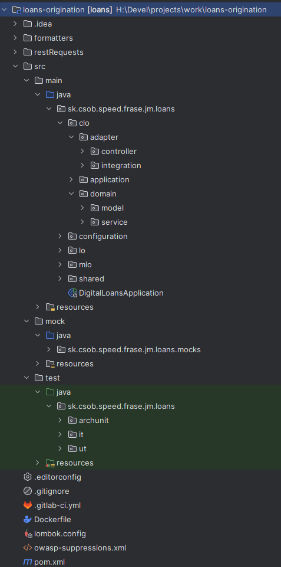

# ČSOB AREX

## Kontext projektu

### Predmet projektu

Prepis online procesov implementovaných v technológii Avoka do nových technológií&#x20;

* Povodná technológia: Avoka (Temenos)
* Nové technológie: Java, Spring Boot, Camunda 7

Na prvý pohľad sa projekt veľmi podobal na FENX, akurát bol jeho uplným opakom.

### Rozsah projektu

* 8 procesov (rôzneho rozsahu)
* 1+ rok práce
* 15 ľudí (Softec tím)

### Výstup projektu

Dodali sme

* 🖥️ 8 FE appka (Angular)
* ⚙️ 4 Mikroslužby / procesné aplikácie (Camunda BPMN) v Java
  * Card issuance (vydanie debetnej karty a cestovné poistenie ku karte)
  * Amendments (+ACQ)
  * Loans origination (spotrebný úver a hypotéka)
  * Account sales (zriadenie účtu pre fyzickú osobu / 1-osobovú firmu)

### Analýza

* na rozdieľ od FENX, kde bolo výstupom analýzy programovanie v Confluence, tu bol výstup priamo Java kód (model a doménová logika)
* vývoj BE boli prevažne integrácie (podľa definovaného mappingu) a perzistencia

## Technológie

* Onion / hexagonálna architektúra (po ťažkom boji 😁)
* Spring - Spring Boot 3.x, Spring MVC
* Java 17
* Tomcat 10
* Camunda BPMN
* JDBC ("Hibernate som zakázal")
* Flyway
* PostgreSQL
* MapStruct
* Maven
* GitLab CI / Bamboo

### Deployment architecture

Interné prostredie: DevOps linka a prosterdie založené na Softec DevOps frameworku a OpenShift-e 👍

ČSOB prostredie: Niekoľko osobitných typov prostredí / serverových clusterov (+ rozdelenie na <mark style="color:blue;">blue</mark>-<mark style="color:green;">green</mark>)

* FE
  * SPA
  * SPA Public
  * SPA BOF
* BFF&#x20;
  * NOA - aplikácie pre public web (neautentifikovaných zákazníkov)
  * EIDP - aplikácie pre autentifikovaných zákazníkov
  * AAD - aplikácie pre (autentifikovaných) agentov
  * BOF - aplikácie pre back-office (Camunda worklist)
* DBAPI - aplikácie s prístupom k databáze 😊
  * ostatné aplikácie mohli k databáze pristupovať len cez REST API vystavené cez tieto aplikácie 🤷‍♂️

Typická naša aplikácia bola&#x20;

* rozdelená na 2 samostatne nasadzované aplikácie (BFF + DBAPI) 🤔
* nasadzované do 3 prostredí EIDP + BOF + DBAPI 😮
* nachádzala sa v 4 GIT repozitároch (BFF API + BFF APP + DBAPI API + DBAPI APP) 🤯

## Čo sa osvedčilo a čo nie

### Testy

#### E2E JUnit testy&#x20;

* komplexne testovali desiatky scenárov
* interakcia s aplikáciou v teste na úrovni jej REST API&#x20;
* integrované systémy sme simulovali mockmi na úrovni REST / SOAP API

```java
@Test
void test14a_contract_signature_ready_to_sign_then_signed() {
    ClientCtx ctx = initTestScenario(MockTestData.IPPID_CLO_SIG_CONTRACT_READY_TO_SIGN);

    var cmd = flowToContractSignature(ctx);
    assertEquals(CLOCustomerUiTask.SIGN_CONTRACT, cmd.getCmdType());

    cmd = returnFromContractSignature(ctx, cmd.getApplicationId(), null);
    assertEquals(CLOCustomerUiTask.THANK_YOU, cmd.getCmdType());
    assertEquals(0, scenario.callCount(Interfaces.GENERATE_DOCUMENT));

    cmd = returnFromContractSignature(ctx, cmd.getApplicationId(), null);
    checkExpectedInfo(cmd,  LODTInfoScreen.OUTAGE);
}
```

#### ArchUnit testy

* kontrola architektúry aplikácie (onion, layered, ...)

```java
@ArchTest
static final ArchRule app_layers_are_respected = Architectures.layeredArchitecture().consideringAllDependencies()
        .layer("mocks").definedBy("..loans.mocks..")
        .layer("shared").definedBy("..loans.shared..")
        .layer("server").definedBy("..loans.server..")
        .layer("logic").definedBy(
                "..loans.lo..",
                "..loans.clo..",
                "..loans.mlo..",
                "..loans.authenticateduser..")
        .whereLayer("shared").mayOnlyBeAccessedByLayers("server", "logic")
        .whereLayer("logic").mayOnlyBeAccessedByLayers("server")
        .whereLayer("mocks").mayNotBeAccessedByAnyLayer()
        .whereLayer("server").mayNotBeAccessedByAnyLayer();


@ArchTest
static final ArchRule noCycles = SlicesRuleDefinition.slices()
        .matching("sk.csob.speed.frase.loans.(*)..")
        .should().beFreeOfCycles();
```

#### Persistence testy

* Embedded PostgreSQL (Zonky)

```xml
<dependency>
	<groupId>io.zonky.test</groupId>
	<artifactId>embedded-postgres</artifactId>
	<version>2.0.7</version>
	<scope>test</scope>
</dependency>

<dependency>
	<groupId>io.zonky.test</groupId>
	<artifactId>embedded-database-spring-test</artifactId>
	<version>2.5.1</version>
	<scope>test</scope>
</dependency>
```

```yaml
zonky:
  test:
    database:
      provider: zonky
      type: postgres
      refresh: before_each_test_method

```

```java
@SpringBootTest
@AutoConfigureEmbeddedDatabase // zonky
class AmeOrderPersistenceTests {

    @Autowired
    private AmeOrderService ameOrderService;

    @Test
    @Transactional
    void create_update_read_should_work() {
        // test create
        AmeOrder ameOrderToCreate = genOrderToCreate();
        AmeOrder createdOrder = ameOrderService.writeAmeOrder(ameOrderToCreate);

        // verify create returned something
        assertThat(createdOrder).isNotNull();

        ...
    }
}
```

### Aplikačná architektúra

* 2 typy aplikácii
  * BFF -  clean architecture (onion / hexagonal)
  * DBAPI - layered architecture
* single-module projekty
  * v tomto prípade by malo zmysel aj multi-modul projekty, aby sme vedeli vyskladať finálne WAR-ká pre dané prostredie len s potrebnými triedami
* onion / hexagonálna architektúra
* oddelenie perzistentnej vrstvy do osobitnej aplikácie (GIT repozitára) 😡
* oddelenie API modulu do osobitného GIT repozitára 😡
* mapovanie medzi modeli - MapStruct&#x20;
* mocky integrovaných systémov ako súčasť každej aplikácie
  * len špecifické služby, ktoré aplikácia volala&#x20;
  * používali sa ako pre JUnit testy, tak aj pri behu na našom prostredí - interné testy
  * osobitný source root `src/mock` 💡


<div><figure><figcaption></figcaption></figure> <figure><figcaption></figcaption></figure></div>

